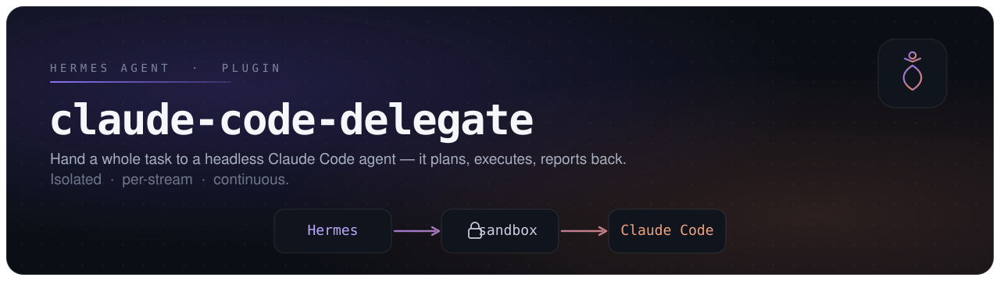
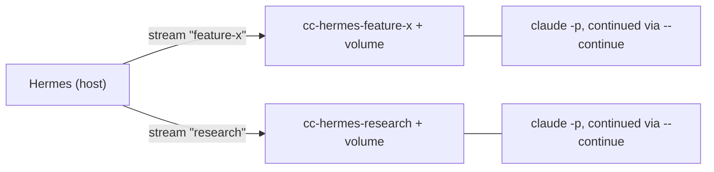

<div align="center">



<br/>
<br/>

[](https://github.com/NousResearch/hermes-agent)
[](https://docs.claude.com/en/docs/claude-code)
[](https://www.docker.com/)
[](./LICENSE)

</div>

> [!NOTE]
> This runs **`claude -p`** (Claude Code as a *full autonomous agent*), not `claude mcp serve` (which would merely lend Claude's tools to Hermes' model). That distinction is the whole point: **Claude's model does the work.**

---

## Contents

- [Why this exists](#why-this-exists)
- [How it works](#how-it-works)
- [Quick start](#quick-start)
- [Permission modes](#permission-modes)
- [Tools and commands](#tools-and-commands)
- [Streams and continuity](#streams-and-continuity)
- [Configuration](#configuration)
- [Testing](#testing)
- [Troubleshooting](#troubleshooting)
- [Architecture](#architecture)
- [Security notes](#security-notes)
- [Contributing](#contributing)
- [License](#license)

---

## Why this exists

| Concern | Decision |
|---|---|
| **True delegation** — Claude's model should do the work | Runs `claude -p` (headless agent), **not** `claude mcp serve` |
| **Continuity** across many tasks | **One warm container per stream**, reused via `docker exec`; `--continue` keeps the same conversation |
| **No cold-start tax** every task | `docker stop`/`start` hibernation; state lives on a per-stream **named volume** (repo, deps, `~/.claude`) |
| **Isolation** | The container is the blast radius (`--cap-drop ALL`, `no-new-privileges`, mem/cpu limits). Boundary = the **stream**, not each task |

---

## How it works

A delegated task in the default `boundary` mode, end to end:

```mermaid
sequenceDiagram
    actor User
    participant Hermes as Hermes (orchestrator)
    participant Plugin as delegate_to_claude_code
    participant Box as Docker sandbox (per stream)
    participant CC as Claude Code (headless)

    User->>Hermes: "Delegate: create hello.py"
    Hermes->>Plugin: call (permission_mode=boundary)
    Plugin-->>Hermes: status = approval_required (+ preview)
    Hermes->>User: Approve running this in the sandbox?
    User->>Hermes: yes
    Hermes->>Plugin: call again (confirmed=true)
    Plugin->>Box: ensure warm container + volume
    Plugin->>CC: claude -p "<task>" --output-format json
    CC-->>Plugin: JSON result
    Plugin-->>Hermes: { status: completed, result, ... }
    Hermes-->>User: summary
```

Each **stream** is its own isolated container + volume, so unrelated work never shares state:



---

## Quick start

> [!IMPORTANT]
> **Prerequisites:** Docker running (`docker info`), Hermes installed (`hermes --version`), and an `ANTHROPIC_API_KEY`.

```bash
# 1. Clone into your Hermes plugins directory
git clone https://github.com/amanasmuei/hermes-claude-code-delegate \
  ~/.hermes/plugins/claude-code-delegate

# 2. Build the sandbox image (Claude runs inside this)
docker build -t claude-sandbox:latest ~/.hermes/plugins/claude-code-delegate

# 3. Provide your key and enable the plugin
export ANTHROPIC_API_KEY=sk-ant-...
hermes plugins enable claude-code-delegate

# 4. Restart Hermes, then confirm it registered
hermes plugins list      # -> claude-code-delegate: enabled
```

Then, in any conversation:

> *"Delegate to Claude Code in **plan** mode: list the workspace files and propose a hello-world script."*

`plan` mode changes nothing, so it is the safest first run.

---

## Permission modes

Headless Claude **cannot** pause and ask a human mid-run — so you choose the posture up front via `permission_mode`:

| Mode | Hermes-side gate | Inside the box | Best for |
|---|---|---|---|
| **`boundary`** _(default)_ | Returns `approval_required`; user OKs in chat then re-call with `confirmed=true` | `--permission-mode acceptEdits` | First run / sensitive work |
| **`sandbox`** | none | `--dangerously-skip-permissions` | Autonomous / continuous (trust the box) |
| **`acceptEdits`** | none | `--permission-mode acceptEdits` | Auto-edit; risky ops denied + reported |
| **`plan`** | none | `--permission-mode plan` | Dry run — Claude plans, changes nothing |

The `boundary` handshake happens **inside the conversation**, so it works identically from the CLI *and* from gateway platforms (Telegram, Discord, …). If Claude reports it was blocked for lack of permission, the result carries `blocked_on_permissions: true` so it can be surfaced to the user.

<details>
<summary><strong>Why there is no live per-action approval bridge</strong></summary>

<br/>

Claude Code *can* externalize each permission decision (`--permission-prompt-tool` / SDK `canUseTool`) back to an orchestrator. It is intentionally **not** wired in here because it **blocks the agent until a human answers** — which fights the async/background model ("talk to it from Telegram while it works"). The cleaner mental model: you already chose to trust the box by isolating it, so authorize *within* the box and put the human checkpoint at the box's **boundary**. Add the live bridge only if your users are always present synchronously.

</details>

---

## Tools and commands

| Kind | Name | Signature |
|---|---|---|
| Tool | `delegate_to_claude_code` | `(task, stream_id?, permission_mode?, confirmed?, fresh_session?, timeout_seconds?)` |
| Tool | `claude_code_streams` | `(action: list \| stop \| remove, stream_id?)` |
| Command | `/cc-streams` | `[list \| stop \| remove] [stream_id]` |
| Hook | `on_session_end` | Auto-hibernates running sandboxes (volumes kept) |

<details>
<summary><strong>Parameter reference — <code>delegate_to_claude_code</code></strong></summary>

<br/>

| Param | Type | Default | Notes |
|---|---|---|---|
| `task` | string | — | **Required.** A standalone instruction; Claude does not see the Hermes conversation. |
| `stream_id` | string | `"default"` | Same id ⇒ same warm container + continued conversation. `[A-Za-z0-9_-]{1,64}`. |
| `permission_mode` | enum | `"boundary"` | `boundary` \| `sandbox` \| `acceptEdits` \| `plan`. |
| `confirmed` | bool | `false` | Set `true` only after the user approved a prior `approval_required`. |
| `fresh_session` | bool | `false` | Start a new Claude conversation in the stream (files still persist). |
| `timeout_seconds` | int | `1800` | On timeout the container is left **warm** so you can continue. |

</details>

---

## Streams and continuity

- A **stream** is one line of related work. Tasks sharing a `stream_id` reuse a single warm container (`cc-hermes-<stream_id>`) and a persistent volume (`cc-hermes-vol-<stream_id>`) mounted at `/work`, with `HOME=/work` so Claude's `~/.claude` session store persists too.
- After the first task, subsequent tasks pass `--continue` so they continue the **same conversation** — Claude remembers prior work instead of re-discovering the codebase.
- Between bursts, containers **hibernate** (`docker stop`); the next task starts them warm. State survives on the volume.

```bash
/cc-streams list              # see streams and their state
/cc-streams stop feature-x    # hibernate (state kept)
/cc-streams remove feature-x  # destroy container + volume (irreversible)
```

---

## Configuration

| Variable | Default | Purpose |
|---|---|---|
| `ANTHROPIC_API_KEY` | — | **Required.** Baked into the container at stream creation. |
| `CLAUDE_SANDBOX_IMAGE` | `claude-sandbox:latest` | Image with `claude` on `PATH`. Bake in project toolchains here. |
| `CC_DELEGATE_MEMORY` | `4g` | Per-stream container `--memory` limit. |
| `CC_DELEGATE_CPUS` | `2` | Per-stream container `--cpus` limit. |

> [!TIP]
> Rotating your API key? The key is captured when a stream's container is created — `remove` and recreate the stream to pick up a new key.

---

## Testing

A full, staged test path (plan → boundary → continuity → stream management) lives in **[ONBOARDING.md](./ONBOARDING.md)**. Start there if you are verifying the plugin on a new setup.

---

## Troubleshooting

<details>
<summary><code>docker not found on PATH where Hermes runs</code></summary>

<br/>

The plugin shells out to `docker`. Ensure Docker is installed and the user running Hermes can run `docker info` without `sudo`.
</details>

<details>
<summary>Tasks start cold / Claude does not remember previous work</summary>

<br/>

Continuity relies on the stream's volume and the `--continue` flag. Confirm you are reusing the **same `stream_id`**, and that you did not pass `fresh_session: true`. Check the volume exists: `docker volume ls | grep cc-hermes-vol`.
</details>

<details>
<summary>Result looks truncated or fields are missing</summary>

<br/>

Parsing of `claude -p --output-format json` is defensive, but field names can vary across Claude Code versions. Capture the raw output and open a bug report:

```bash
docker exec cc-hermes-default claude -p "say hi" --output-format json
```
</details>

<details>
<summary>Claude says it was blocked or could not do something</summary>

<br/>

In headless mode there is no interactive prompt — if an action is not permitted it is denied and reported. Use a less restrictive `permission_mode` (e.g. `sandbox`, since the container is isolated), or check `blocked_on_permissions` in the result.
</details>

---

## Architecture

<details>
<summary><strong>Repository layout</strong></summary>

<br/>

```text
claude-code-delegate/
├── plugin.yaml          # manifest; gates on ANTHROPIC_API_KEY
├── __init__.py          # register(ctx): wires tools, gate, command, hook
├── schemas.py           # LLM-facing tool contracts
├── claude_runner.py     # container lifecycle + claude invocation + JSON parsing
├── Dockerfile           # sandbox image (claude-sandbox:latest)
├── ONBOARDING.md        # tester quick-start and test path
└── .github/
    ├── assets/banner.svg
    └── ISSUE_TEMPLATE/
        ├── bug_report.yml
        ├── test_report.yml
        └── config.yml
```
</details>

<details>
<summary><strong>Design principles</strong></summary>

<br/>

- **Isolation boundary = the stream**, not the task — related tasks share a warm box; unrelated streams stay separate.
- **No shell-injection surface** — every subprocess call uses argv lists (never `shell=True`); `stream_id` is allowlist-validated.
- **Fail loud** — real errors are surfaced to Hermes rather than returning a silent half-result.
- **Cleanup never breaks teardown** — the hibernate hook swallows its own errors.

</details>

---

## Security notes

- The sandbox needs **network access** (Claude must reach the API), so it is **not** run with `--network none`.
- Hardening applied per container: `--cap-drop ALL`, `--security-opt no-new-privileges`, memory/CPU limits.
- For throwaway **per-task** isolation of an *untrusted* task, use a fresh `stream_id` and `remove` it afterward.
- `sandbox` mode uses `--dangerously-skip-permissions` — acceptable **only** because the blast radius is the isolated container. Never repurpose this to run Claude unsandboxed on the host.

---

## Contributing

Issues and PRs welcome. When reporting, please use a template:

- **[Bug report](https://github.com/amanasmuei/hermes-claude-code-delegate/issues/new?template=bug_report.yml)** — something errored or misbehaved.
- **[Test report](https://github.com/amanasmuei/hermes-claude-code-delegate/issues/new?template=test_report.yml)** — confirm it works on your setup.

Include your Hermes version, Claude Code version (`claude --version`), Docker version, OS, and the `permission_mode` used.

---

## License

[MIT](./LICENSE) © amanasmuei

<div align="center"><sub>Built for <a href="https://github.com/NousResearch/hermes-agent">Hermes Agent</a> · delegates to <a href="https://docs.claude.com/en/docs/claude-code">Claude Code</a></sub></div>
